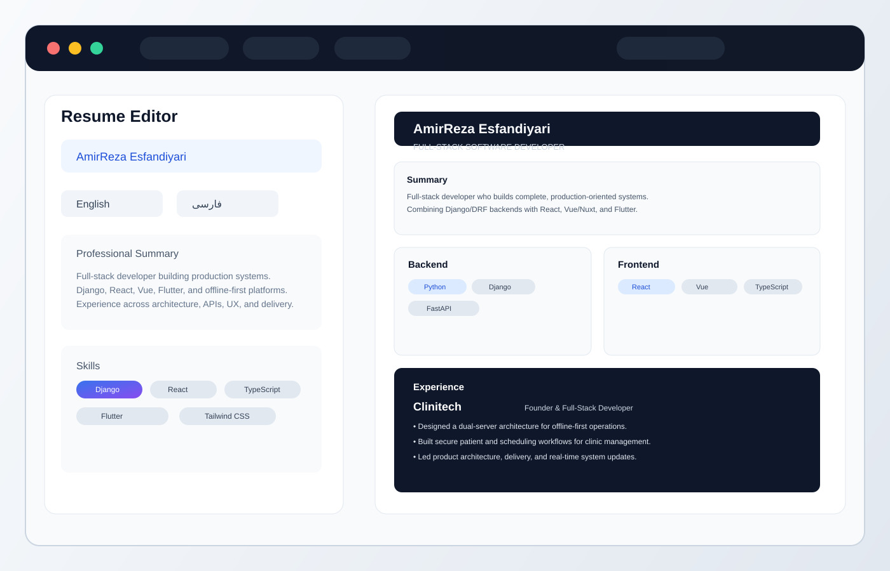

# Dual Language Resume Builder

A Vite + React app for creating and exporting bilingual resumes in English and Persian (Farsi), with live preview, multiple layout options, and PDF/print export support.

This project is designed for people who want to present a resume in two languages side-by-side or switch between languages while editing.

## Screenshot



## Features

- Bilingual resume editing for English and Persian
- Single and split preview modes
- Multiple resume layouts
- Real-time live preview as you edit
- PDF export and browser print support
- JSON backup/import support
- Local persistence using browser storage
- Responsive layout for desktop and smaller screens

## Tech Stack

- React 19
- TypeScript
- Vite
- Tailwind CSS
- HTML2Canvas / jsPDF for export
- Lucide icons

## Project Structure

```text
src/
  App.tsx                  # Main application shell
  types.ts                 # Shared types
  data/
    initialData.ts         # Default sample bilingual resume data
  components/
    ResumeEditor.tsx       # Editing interface
    ResumePreview.tsx      # Resume display preview
    Toolbar.tsx            # Main controls and settings
    layouts/               # Layout templates
    modals/                # Prompt/import modal
  utils/
    pdfExport.ts           # PDF export helpers
    githubPromptGenerator.ts
```

## Getting Started

### 1) Install dependencies

```bash
npm install --legacy-peer-deps
```

This project currently uses a Vite/Tailwind dependency combination that can trigger a peer dependency conflict in npm. The legacy flag is the safe workaround in this workspace.

### 2) Run the development server

```bash
npm run dev
```

Then open the local URL shown in the terminal, usually:

```text
http://localhost:3000/
```

### 3) Build for production

```bash
npm run build
```

The production build output will be generated in the `dist/` folder.

## Available Scripts

```bash
npm run dev       # start the Vite dev server
npm run build     # create a production build
npm run preview   # preview the built app locally
npm run lint      # run TypeScript type checking
```

## How it Works

- The app stores resume state in `localStorage` so progress is preserved between reloads.
- A default bilingual resume is provided in `src/data/initialData.ts`.
- You can edit fields, switch layouts, change language focus, and export the final resume as a PDF.
- Import/export utilities allow saving resume content as JSON for backups or transfer.

## Common Notes

- The app is optimized for a bilingual CV/resume workflow, especially with English + Persian content.
- The sample data is pre-populated with a software developer profile and can be reset from the app UI.
- Export behavior may vary slightly by browser; the project supports both PDF download and print-to-PDF workflows.

## License

This project is for personal or project use and is not currently configured with a formal license file.

## Troubleshooting

### Peer dependency conflict during install

If `npm install` fails with an ERESOLVE error, use:

```bash
npm install --legacy-peer-deps
```

### Vite warning about __dirname

The app may show a harmless Vite warning about `__dirname` usage in `vite.config.ts`. It does not block development or production builds.

## Contributing

Feel free to fork the project, customize the templates, or add new resume layouts. The app is structured so the data model and layout components can be extended fairly easily.
